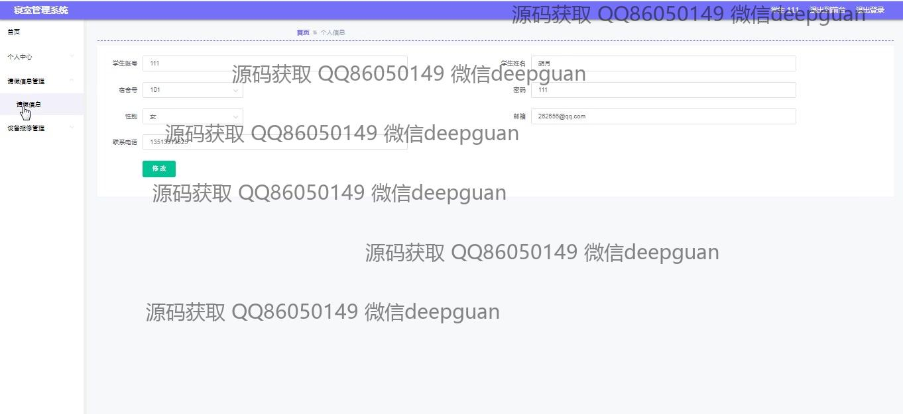
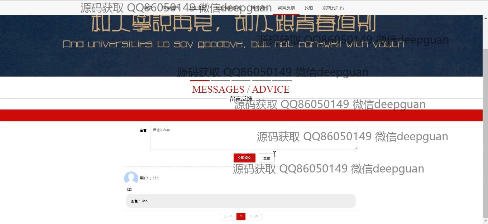

<h1 align="center">学生寝室宿舍卫生评比管理系统vue</h1>

## 简介
学生寝室宿舍卫生评比管理系统：角色分为管理员、学生、宿舍长；功能包括学生管理、宿舍管理、卫生评比、设备报修、留言反馈、新闻资讯等，提升宿舍卫生管理和信息沟通效率。    --计算机毕业设计源码；毕设源码；java毕业设计源码

## 联系方式

<h3 align="center">获取完整代码与数据库文件 + 微信：deepguan QQ: 86050149 QQ群: 783742310</h3>

<h3 align="center">可帮忙远程部署 包运行成功！提供远程部署、修改代码、设计文档指导、代码讲解等服务！</h3>

## 功能介绍（完整见运行截图）
管理员：提供登录、注册和退出功能。主界面包含导航栏，模块包括学生管理、宿舍管理、卫生检查管理、投诉信息管理。可以管理和更新系统内的所有数据信息，如学生信息、宿舍信息，处理设备报修，发布新闻资讯和宿舍卫生评比的公告，并核审评比结果。提供留言管理功能，方便管理员与学生进行沟通。  
宿舍长：拥有个人信息管理功能，包括姓名、宿舍号、联系方式等。可以查看宿舍通告、发布和管理宿舍评比结果，进行卫生检查并录入评比信息。支持设备报修的发布和管理。能够查看和管理个人留言，便于处理宿舍卫生评比相关反馈。  
学生：可以通过登录界面进入系统，查看个人中心、宿舍通告和卫生通报。可以上传宿舍卫生评比结果、管理个人资料，使用新闻资讯模块获取宿舍相关最新信息。支持参与宿舍卫生评分并进行反馈，通过留言模块发布意见和建议。

## 运行截图

本代码来源于网络,仅供学习参考使用!

